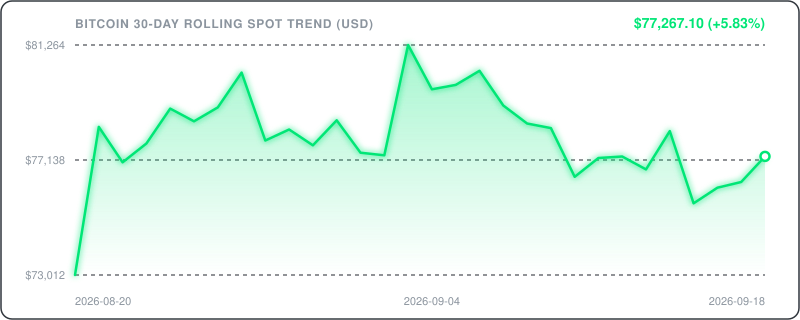

# 🪙 Bitcoin & Crypto Historical Tracker

<div align="center">

[](https://github.com)
[](https://github.com)
[](https://github.com/features/actions)
[](https://api.binance.com)
[](https://github.com)

</div>

---

### 📊 Executive Market Telemetry

Real-time Bitcoin ($BTC) market tracking telemetry, algorithmic historical benchmarks, and rolling price-action matrix. Fully automated and synced via GitHub Actions CI/CD pipeline with zero external database dependencies.

| Telemetry Metric | Spot Value (USD) | 24h Trend / Spread | Reference Context |
| :--- | :--- | :--- | :--- |
| **Current BTC Price** | **$71,336.53** | 🟢 `+1.11%` | Real-time Aggregate Spot |
| **24h Price Range** | `$70,408.00 — $72,026.09` | `Spread: $1,618.09` | Intraday Volatility Band |
| **24h Trading Volume** | `$1.26 B` | `17,719.50 BTC` | 24h Spot Pair Turnover |
| **Estimated Market Cap** | `$1.42 T` | `Rank #1` | Circulating Supply: ~19.85M BTC |

---

### 📈 30-Day Rolling Price Action & Volatility Trend

<div align="center">
  
</div>

---

### 📊 Multi-Timeframe Performance & ROI Matrix

Comparison of current spot valuation against standard macroeconomic and historical milestones.

| Timeframe Horizon | Benchmark Date | Historical Base Price | Net Change ($) | ROI Return (%) | Direction & Velocity |
| :--- | :---: | :---: | :---: | :---: | :---: |
| **24 Hours** | `2026-03-24` | $70,556.74 | `+$779.79` | 🟢 +1.11% | Intraday Shift |
| **7 Days** | `2026-03-18` | $71,246.54 | `+$89.99` | 🟢 +0.13% | Weekly Momentum |
| **30 Days (1M)** | `2026-02-23` | $64,656.02 | `+$6,680.51` | 🟢 +10.33% | Monthly Trajectory |
| **90 Days (Quarterly)** | `2025-12-25` | $87,225.27 | `-$15,888.74` | 🔴 -18.22% | Quarterly Baseline |
| **180 Days (Half-Year)** | `2025-09-26` | $109,643.46 | `-$38,306.93` | 🔴 -34.94% | Semi-Annual Cycle |
| **365 Days (1 Year)** | `2025-03-25` | $87,392.87 | `-$16,056.34` | 🔴 -18.37% | Macro Annual Delta |
| **All-Time High (ATH)** | `2025-10-06` | $126,199.63 | `-$54,863.10` | 🔴 `-43.47%` | Peak Drawdown |

---

### 🗓️ Rolling 7-Day Price Action Log

Detailed historical daily candlestick telemetry for the last 7 trading sessions.

| Date (UTC) | Open (USD) | High (USD) | Low (USD) | Close (USD) | 24h Change | Volume (BTC) |
| :---: | :---: | :---: | :---: | :---: | :---: |
| `2026-03-25` | $70,556.74 | $72,026.09 | $70,408.00 | $71,336.53 | 🟢 +1.11% | `17,719.50 BTC` |
| `2026-03-24` | $70,906.45 | $71,400.00 | $68,923.07 | $70,556.74 | 🔴 -0.49% | `20,702.42 BTC` |
| `2026-03-23` | $67,859.00 | $71,817.09 | $67,445.18 | $70,906.45 | 🟢 +4.49% | `28,335.09 BTC` |
| `2026-03-22` | $68,918.12 | $69,588.79 | $67,360.66 | $67,859.00 | 🔴 -1.54% | `14,843.79 BTC` |
| `2026-03-21` | $70,510.73 | $71,100.94 | $68,571.42 | $68,918.12 | 🔴 -2.26% | `13,397.17 BTC` |
| `2026-03-20` | $69,930.01 | $71,367.00 | $69,388.00 | $70,510.73 | 🟢 +0.83% | `18,121.17 BTC` |
| `2026-03-19` | $71,246.55 | $71,613.79 | $68,793.35 | $69,930.00 | 🔴 -1.85% | `22,364.82 BTC` |

---

### ⚙️ Automation & Pipeline Architecture

- **Automated Execution:** Synced daily at `00:00 UTC` via GitHub Actions (`.github/workflows/update.yml`).
- **Zero Overhead:** Pure Python engine generating dynamic SVG vector graphics and Markdown dashboards without heavy dependencies.
- **Git-Native Telemetry:** Historical state is preserved directly in Git commit history without third-party databases.

```
[ GitHub Actions Cron: 00:00 UTC ]
               │
               ▼
   [ fetch_btc.py Executed ] ──► [ Query Binance / CoinGecko API ]
               │
               ▼
   [ Generate assets/btc_trend.svg & README.md ]
               │
               ▼
   [ Auto Git Commit & Push (main) ]
```

---

<div align="center">

*Last Telemetry Sync: `2026-03-25 17:15:29 UTC` • Data Feed: `Binance Spot (BTC/USDT)` • Status: `Operational (HTTP 200 OK)`*

</div>
