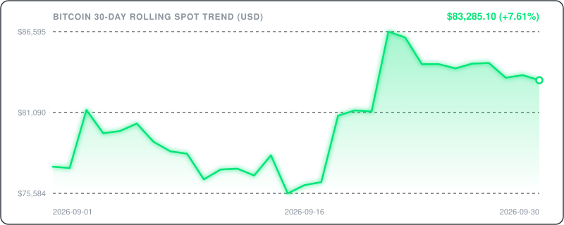

# 🪙 Bitcoin & Crypto Historical Tracker

<div align="center">

[](https://github.com)
[](https://github.com)
[](https://github.com/features/actions)
[](https://api.binance.com)
[](https://github.com)

</div>

---

### 📊 Executive Market Telemetry

Real-time Bitcoin ($BTC) market tracking telemetry, algorithmic historical benchmarks, and rolling price-action matrix. Fully automated and synced via GitHub Actions CI/CD pipeline with zero external database dependencies.

| Telemetry Metric | Spot Value (USD) | 24h Trend / Spread | Reference Context |
| :--- | :--- | :--- | :--- |
| **Current BTC Price** | **$85,555.60** | 🔴 `-1.09%` | Real-time Aggregate Spot |
| **24h Price Range** | `$85,456.52 — $86,996.00` | `Spread: $1,539.48` | Intraday Volatility Band |
| **24h Trading Volume** | `$75.35 M` | `880.69 BTC` | 24h Spot Pair Turnover |
| **Estimated Market Cap** | `$1.70 T` | `Rank #1` | Circulating Supply: ~19.85M BTC |

---

### 📈 30-Day Rolling Price Action & Volatility Trend

<div align="center">
  
</div>

---

### 📊 Multi-Timeframe Performance & ROI Matrix

Comparison of current spot valuation against standard macroeconomic and historical milestones.

| Timeframe Horizon | Benchmark Date | Historical Base Price | Net Change ($) | ROI Return (%) | Direction & Velocity |
| :--- | :---: | :---: | :---: | :---: | :---: |
| **24 Hours** | `2026-10-04` | $86,507.11 | `-$951.51` | 🔴 -1.10% | Intraday Shift |
| **7 Days** | `2026-09-28` | $83,456.74 | `+$2,098.86` | 🟢 +2.51% | Weekly Momentum |
| **30 Days (1M)** | `2026-09-05` | $79,831.57 | `+$5,724.03` | 🟢 +7.17% | Monthly Trajectory |
| **90 Days (Quarterly)** | `2026-07-07` | $63,323.27 | `+$22,232.33` | 🟢 +35.11% | Quarterly Baseline |
| **180 Days (Half-Year)** | `2026-04-08` | $71,085.99 | `+$14,469.61` | 🟢 +20.36% | Semi-Annual Cycle |
| **365 Days (1 Year)** | `2025-10-21` | $108,362.27 | `-$22,806.67` | 🔴 -21.05% | Macro Annual Delta |
| **All-Time High (ATH)** | `2025-10-27` | $116,410.06 | `-$30,854.46` | 🔴 `-26.50%` | Peak Drawdown |

---

### 🗓️ Rolling 7-Day Price Action Log

Detailed historical daily candlestick telemetry for the last 7 trading sessions.

| Date (UTC) | Open (USD) | High (USD) | Low (USD) | Close (USD) | 24h Change | Volume (BTC) |
| :---: | :---: | :---: | :---: | :---: | :---: | :---: |
| `2026-10-05` | $86,502.65 | $86,996.00 | $85,456.52 | $85,555.60 | 🔴 -1.09% | `880.69 BTC` |
| `2026-10-04` | $84,742.22 | $86,792.81 | $84,700.02 | $86,507.11 | 🟢 +2.08% | `2,622.78 BTC` |
| `2026-10-03` | $84,504.88 | $85,021.57 | $84,425.07 | $84,742.22 | 🟢 +0.28% | `1,921.25 BTC` |
| `2026-10-02` | $84,848.73 | $87,249.05 | $83,850.02 | $84,504.88 | 🔴 -0.41% | `8,762.23 BTC` |
| `2026-10-01` | $83,556.14 | $85,244.00 | $83,107.03 | $84,848.73 | 🟢 +1.55% | `6,608.92 BTC` |
| `2026-09-30` | $83,638.42 | $85,613.72 | $82,911.86 | $83,556.14 | 🔴 -0.10% | `7,049.24 BTC` |
| `2026-09-29` | $83,456.74 | $84,557.01 | $82,736.00 | $83,638.42 | 🟢 +0.22% | `4,975.87 BTC` |

---

### ⚙️ Automation & Pipeline Architecture

- **Automated Execution:** Synced daily at `00:00 UTC` via GitHub Actions (`.github/workflows/update.yml`).
- **Resilient Pipeline:** Cascading multi-exchange API architecture (Binance -> Coinbase -> Kraken -> CoinGecko).
- **Git-Native Telemetry:** Dynamic SVG vector graphics and Markdown dashboards saved directly into Git history.

```
[ GitHub Actions Cron: 00:00 UTC ]
               │
               ▼
   [ fetch_btc.py Executed ] ──► [ Query Multi-Exchange Feeds ]
               │
               ▼
   [ Generate assets/btc_trend.svg & README.md ]
               │
               ▼
   [ Auto Git Commit & Push (main) ]
```

---

<div align="center">

*Last Telemetry Sync: `2026-10-05 04:39:47 UTC` • Data Feed: `Coinbase Exchange API (BTC/USD)` • Status: `Operational (HTTP 200 OK)`*

</div>
